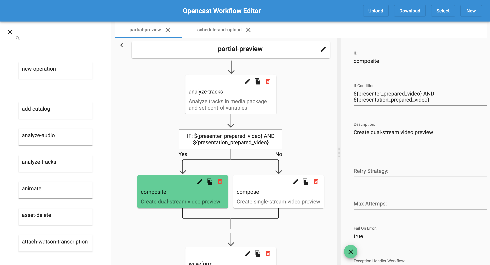

# Opencast Workflow Editor

A visual workflow editor for [Opencast](https://opencast.org/).



## Usage

### Self-hosted

Opencast Workflow Editor runs entirely in the browser and has not backend component. Deploying the Opencast Workflow
Editor is thus as simple as dropping it in your web server folder.

## Build Instructions

To build a distribution version, run the following commands:

```sh
$ npm install
$ npm run build # or buildProd for production builds
```

This will generate a deployable version in the `dist/opencast-workflow-editor` folder.

When developing you might want to run `npm start` instead to serve a compiled version and automatically recompile on
file changes.
